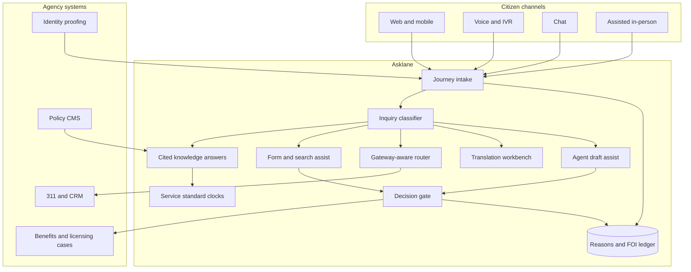

# Asklane

**Source:** `ai-in-gov/deloitte-artificial_intelligence_for_citizen_services/`
**Domain:** `ai-gov`
**One-liner:** A citizen-inquiry and contact-deflection system that answers routine questions, fills and routes service forms, and escalates statutory decisions to humans — so agencies clear backlogs without surrendering duty-to-reasons or appeal rights.
**Wedge:** State and large municipal 311 / benefits contact centres where 65–90% of volume is password resets, “where do I apply,” and already-published FAQ — starting with multilingual channel deflection before any eligibility determination.
**Positioning:** A citizen-journey service layer, not a chatbot kit. Incumbents replace IVR with scripted bots; Asklane treats every contact as a journey touchpoint with service-standard clocks, accessibility and language obligations, identity gates, and a hard ban on automated adverse decisions — matching the source’s insistence that AI augment workers and never decide about citizens.

## Market research synthesis

### Thesis from source

The August 2017 Ash Center paper argues that AI will permeate how citizens interact with government, but that the immediately beneficial opportunities are those that reduce administrative burden, resolve resource-allocation problems, and take on complex but bounded tasks — not those that pretend to fix systemic distrust. Citizen satisfaction with digital government is already weak: only 27% of US citizens reported satisfaction with government digital offerings, while 92% said improved digital services would positively impact their view of government. Broader confidence is worse still — only 7% of citizens in a 2016 Gallup survey had “a great deal” of confidence in Congress — and citizens rank state services below even cable-TV customer service.

The cost of the status quo is structural. Of the $90 billion the federal government spends on technology, 75% goes to maintaining legacy systems. Governing found that 53% of state and local officials surveyed had excessive paperwork burdens. Fully one-third of the Social Security Administration’s nearly 22,000-person workforce was expected to retire by 2022. Deloitte estimates that automation of federal employee tasks could free between 96.7 million and 1.2 billion hours annually, with potential savings between $3.3 billion and $41.1 billion. Colorado child-welfare workers spent 37.5% of their time on documentation versus 9% on contact with children and families — the exact pattern Asklane is designed to reverse for citizen-facing agencies.

The paper’s most actionable contribution is a five-category taxonomy of citizen-inquiry use cases — answering questions, filling out and searching documents, routing requests, translation, and drafting documents — plus six implementation strategies: goals-based and citizen-centric programs; citizen input; build on existing resources (311, SeeClickFix); data preparedness with privacy caution; mitigate ethical risks and avoid AI decision making; and augment employees, do not replace them. Concrete pilots make the wedge concrete: North Carolina help desks where nearly 90% of calls are password support; Surrey’s MySurrey app addressing 65% of questions already answered on city websites after Watson studied 3,000+ documents across 16 services; Mexican petition-routing algorithms; Unbabel’s hybrid translation at $0.02 per chat; Japan METI drafting answers for parliament offices. The product follows from that taxonomy: a multi-channel inquiry fabric that deflects the routine, prepares forms and translations, routes correctly, drafts suggested replies for humans, and refuses to take adverse decisions about citizens.

### Buyer & economic model

- **Primary buyer:** Chief Customer Experience Officer, CIO/digital director, or contact-centre director at a state agency or large city (311, benefits, licensing, tax help).
- **Users:** contact-centre agents and caseworkers (daily), knowledge-base editors and service owners (weekly), accessibility/language compliance officers, FOI/records officers, privacy officers, and agency executives tracking service-standard KPIs.
- **Budget owner / value metric:** contact-centre and benefits-administration operating budgets. Primary value metrics are deflection rate of routine contacts, median time-to-answer versus statutory service standards, first-contact resolution without adverse-decision automation, and agent hours redirected to complex/face-to-face work.
- **Competing status quo:** legacy IVR, static FAQ websites, siloed CRM tickets, third-party translation contracts, and ad-hoc chatbot pilots that replace IVR menus without journey design, appeal paths, or duty-to-reasons logging.

### Domain constraints

- **Regulatory / trust / safety:** statutory service standards and appeal rights; duty to give reasons for decisions; accessibility (WCAG-class obligations) and digital-exclusion accommodations; multilingual service obligations; prohibition on automated adverse determinations about eligibility, benefits, or sanctions without a named human decision-maker; FOI/records retention for citizen interactions.
- **Data sensitivity:** identity verification and fraud risk on benefit and licensing journeys; cross-agency data sharing only through lawful gateways with purpose limitation; consent and opt-in when external datasets are mixed with government-held data; inaccurate data cascading through learning systems.
- **Change-management realities:** 75% of federal IT spend is locked in legacy maintenance; AI must bolt onto existing 311/CRM channels rather than replace them; workforce must be framed as augmentation (White House automation estimates of job threat ranging 9–47% make “replace workers” messaging toxic); citizen co-design of ethics and privacy rules is a stated requirement in the source.

## Business requirements

- BR-1: Routine inquiries that already have published answers must be resolvable without a human agent within the agency’s published service-standard clock, with the answer source cited to the citizen.
- BR-2: Any determination that grants, denies, reduces, or sanctions a citizen entitlement must be made by a named human officer; Asklane may draft, route, or summarise but must never issue the decision.
- BR-3: Every automated response that affects a citizen’s journey must produce a reasons record suitable for appeal and FOI, including what knowledge was used and when escalation to a human occurred.
- BR-4: Channels must meet accessibility and digital-exclusion obligations: voice, text, assisted in-person, and supported language paths, with no channel that is the sole mandatory path for a statutory service.
- BR-5: Multilingual support must cover the agency’s obligated languages for both citizen input and agency output, with human verification for high-stakes translations rather than raw machine output alone.
- BR-6: Form assistance must auto-populate only from data the citizen has already provided or consented to reuse, and must never silently pull third-party data into an application without an explicit legal gateway and notice.
- BR-7: Identity verification and fraud checks may gate high-risk journeys, but failed verification must produce a human-assisted alternative path, not a silent dead-end.
- BR-8: Contact deflection must be measured against a baseline (e.g., password/FAQ share of volume) and reported as agent hours returned to complex work, not as headcount reduction.
- BR-9: Knowledge used for answers must be versioned, owned by a service owner, and retireable when the underlying policy expires — answering from stale policy is a compliance failure.
- BR-10: Cross-agency routing of petitions and cases must record the legal gateway used and the receiving office’s acceptance, so misroutes are auditable and correctable.
- BR-11: Citizen feedback on answer helpfulness must feed supervised learning only under published retention and purpose rules; citizens must be able to opt out of secondary use of their inquiry content.
- BR-12: Commercial contracts for Asklane must price on resolved journeys and service-standard attainment, not on raw message volume that incentivises endless bot loops.

## User stories

Canonical user stories live in sibling [USER_STORIES.md](USER_STORIES.md).

## System design

### Overview

Asklane sits in front of and beside existing citizen channels (web, mobile, voice, chat, in-person assisted). An inquiry is classified into one of the five source categories — answer, form/search, route, translate, draft — then either resolved with cited knowledge, assisted through a form or translation workflow, routed to the correct office under a recorded legal gateway, or handed to a human with a draft. A decision gate blocks any automated grant/deny/sanction. Journey clocks enforce service standards; feedback trains answer ranking under consent rules; FOI-ready records are retained per policy.

### Actors & boundaries

- **Actors:** citizens/applicants, contact-centre agents, caseworkers, service owners, translators/editors, privacy/FOI officers, agency administrators, partner agencies receiving routed petitions.
- **Trust boundary:** citizen personal data stays inside the agency tenancy; partner agencies receive only the minimum case packet authorised by a gateway; model vendors receive de-identified training signals only when opted in.
- **Human-in-the-loop points:** all adverse or entitlement decisions; high-stakes translation verification; fraud-fail identity recovery; citizen-requested escalation; knowledge publication/retirement.

### Core capabilities

1. **Multichannel intake and journey orchestration** — unify web, voice, chat, and assisted channels under one journey state and service-standard clock.
2. **Knowledge answering with citation** — retrieve and cite owned knowledge versions; supervised helpfulness feedback.
3. **Form fill and document search** — guided applications and large-corpus search without silent third-party data fusion.
4. **Request routing with legal gateways** — classify and route petitions/cases with acceptance and audit.
5. **Translation with human verification** — machine draft plus editor verification for obligated languages.
6. **Draft assistance for agents and offices** — NLG drafts for replies; human sends.
7. **Identity, fraud, and exception paths** — verify when required; always offer human-assisted recovery.
8. **Decision gate and reasons ledger** — block automated adverse decisions; record reasons and approver.
9. **Accessibility and language compliance** — channel coverage evidence and digital-exclusion accommodations.
10. **FOI, retention, and governance** — interaction export, consent, opt-out, operator audit logs.

### Conceptual data

- **Primary entities:** Agency, Channel, Journey, Inquiry, KnowledgeArticle, KnowledgeVersion, FormAssistanceSession, RouteAssignment, LegalGateway, TranslationJob, DraftSuggestion, IdentityCheck, DecisionGateEvent, ReasonsRecord, ConsentRecord, ServiceStandardClock, FeedbackSignal, FoIExport.
- **Critical events:** inquiry received, answer cited, form assisted, route accepted/rejected, translation verified, draft accepted/edited, identity failed and recovered, decision blocked or human-approved, clock breached, FOI export issued.
- **Retention / audit needs:** reasons records and journey transcripts retained for appeal and FOI windows; knowledge versions immutable once published; consent and opt-out retained for the life of secondary use; identity artefacts minimised and purpose-bound.

### Integrations (conceptual)

- **Systems of record:** 311/CRM, benefits and licensing case systems, identity proofing providers, content management / policy manuals, telephony/IVR, translation vendor workbenches.
- **Upstream signals:** published policy and FAQ corpora, citizen consent preferences, partner-agency directory and gateway rules, accessibility conformance reports.
- **Downstream actions:** ticket creation, appointment booking, form packet submission, partner-agency handoff, agent desktop suggestions, legislative office draft queues, FOI package generation.

### High-level architecture

Channels feed a journey orchestrator; classification selects a capability; the decision gate sits between any entitlement outcome and the citizen; a reasons ledger and FOI store make the path auditable.

### Success metrics

- **Leading:** share of contacts resolved with citation and no agent; median time-to-first-answer vs service standard; escalation rate on citizen request; knowledge freshness (share of answers from unexpired versions); language coverage on obligated languages; decision-gate block count (should be >0 if misconfigurations exist).
- **Lagging:** citizen satisfaction with digital offerings vs the 27% baseline cited in source; agent hours returned to complex/face-to-face work; appeal overturns attributable to bot misinformation; FOI response time for interaction records; measured deflection of password/FAQ volume toward the 65–90% opportunity band shown in pilots.

## OpenAPI skeleton

Canonical HTTP surface lives in sibling [openapi.yaml](openapi.yaml). Summary:

- **Base path:** `/v1/...`
- **Auth:** `X-API-Key` for channel and case-system integration; Bearer JWT for operators.
- **Resource groups:** Journeys, Knowledge, Forms, Routing, Translations, Decisions, Compliance.
