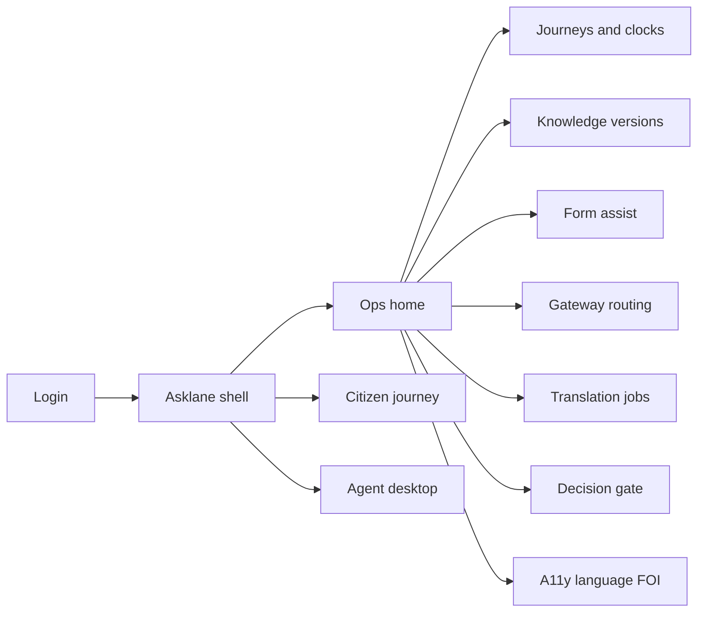
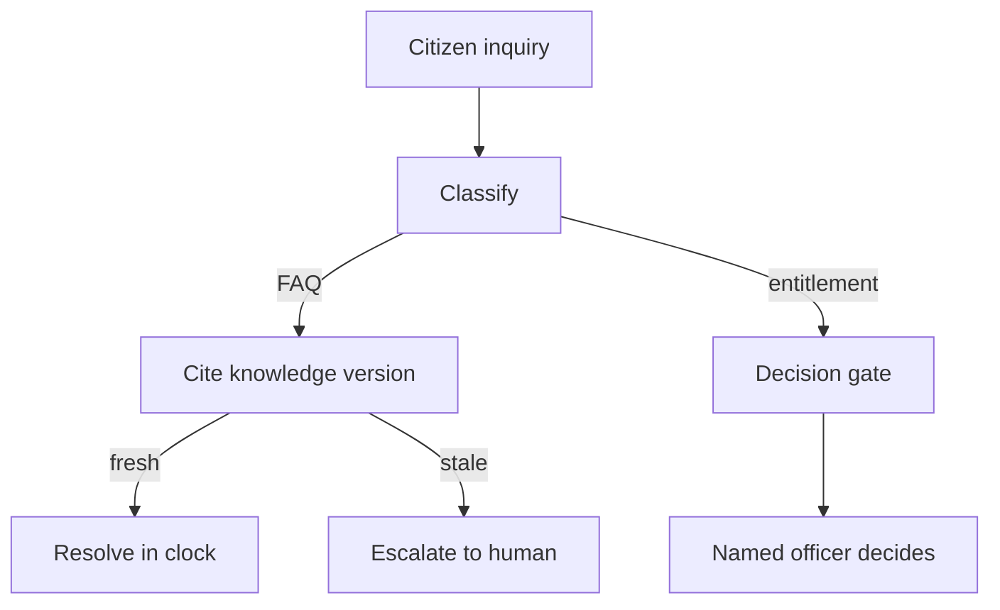

# Asklane — Web app

**Product:** [PRODUCT.md](./PRODUCT.md)
**Primary surface:** Agency citizen-journey operations console (service owners, agents, compliance)
**Secondary surfaces:** Citizen multichannel journey (web/chat/voice/assisted); agent assist desktop; FOI export workspace
**Design thesis:** Asklane is a journey fabric that deflects routine questions and prepares forms — then hard-stops before any grant, deny, reduce, or sanction. The UI metaphor is a service-standard clock and reasons ledger: every automated answer cites an owned knowledge version; every entitlement outcome requires a named human officer; wrong bot answers escalate with full transcript, never a silent dead-end. Visual language is civic daylight — clear sky-blue actions on warm stone ground (not cream-terracotta cliché), with coral only for blocked automated decisions — so trust feels procedural, not “chatbot cute.” The Asklane wordmark sits as a quiet civic mark on every reasons record and clock breach.

## UX research synthesis

### Category peers (best-in-class)

- **GOV.UK / USWDS service patterns:** Plain-language journeys, progressive disclosure, assisted digital. Steal: no sole mandatory chatbot path; reject novelty UX that fails WCAG.
- **City of Surrey MySurrey / modern 311 portals:** Deflection of FAQ already on the website with measurable resolve rates. Steal: cite official sources on answers; reject opaque bot replies without provenance.
- **Zendesk / Genesys agent-assist desks:** Transcript handoff and suggested replies. Steal: escalate with full state so citizens do not repeat themselves; reject headcount-reduction vanity KPIs as the hero metric.
- **Unbabel-style hybrid translation workbenches:** Machine draft + human verify for high stakes. Steal: obligated-language paths with verification gates; reject raw MT alone on benefits clauses.

### Patterns to adopt / reject

- **Adopt:** Five inquiry types (answer, form/search, route, translate, draft); cited knowledge with version ownership; service-standard clocks; decision gate blocking automated adverse outcomes; reasons/FOI ledger; multilingual + assisted channels; identity-fail human recovery; deflection measured as hours to complex work; consent for secondary learning use.
- **Reject:** Chatbot-only statutory paths; automated eligibility decisions; silent third-party data into forms; stale policy answers; message-volume pricing chrome; purple “AI concierge” avatars deciding benefits.

### Trust, density, and workflow constraints from PRODUCT.md

Duty-to-reasons and appeal rights force a ledger, not a chat log (BR-2, BR-3). Accessibility and language obligations are first-class reports (BR-4, BR-5). Knowledge retirement is a compliance failure if ignored (BR-9). Cross-agency routing needs legal gateway + acceptance (BR-10). Commercial success is resolved journeys and clock attainment, not bot loops (BR-12).

## Information architecture

### Nav model

### Roles → default home

| Role | Default home | Why |
|------|--------------|-----|
| Citizen / applicant | Citizen journey | Routine answers with citations (BR-1) |
| Contact-centre agent | Agent desktop | Complex work + drafts (BR-8) |
| Service owner / knowledge editor | Knowledge + journey clocks | Retire stale policy (BR-9) |
| Privacy / FOI / compliance | Decision gate + FOI exports | Block unlawful automation (BR-2, BR-3) |
| Translation editor | Translation jobs | Verify high-stakes output (BR-5) |
| Platform admin | Routing gateways + a11y reports | Misroute audit (BR-10, BR-4) |

### Cross-links to OpenAPI resources

| Nav area | OpenAPI tags / resources |
|----------|---------------------------|
| Journey state and clocks | Journeys |
| Cited answers | Knowledge |
| Guided applications | Forms |
| Cross-agency handoff | Routing |
| Language jobs | Translations |
| Human decision gate / reasons | Decisions |
| A11y, consent, FOI | Compliance |

## Screen inventory

### Ops home

- **Purpose:** See clock breaches, deflection vs complex-work hours, and decision-gate blocks — not raw message volume.
- **Entry:** Agency operator login.
- **Layout regions:** Brand + agency switcher; service-standard clock strip; deflection → hours-returned metric; knowledge stale alerts; blocked automated-decision attempts; FOI backlog.
- **Primary actions:** Open breached journey; retire knowledge; export compliance pack.
- **Empty / loading / error:** Healthy = “clocks green, no gate blocks.”
- **BR / story ties:** BR-1, BR-8, BR-12.

### Citizen journey (multichannel)

- **Purpose:** Resolve routine inquiries with cited official sources inside the service-standard clock.
- **Entry:** Web/chat/voice/assisted with shared journey id.
- **Layout regions:** Question; cited answer + source link; escalate to human; language switch; assisted-digital affordance; clock remaining (non-punitive).
- **Primary actions:** Ask; mark unhelpful; escalate; start form assist.
- **Empty / loading / error:** No answer = escalate, never invent; sole-channel ban notice if misconfigured.
- **BR / story ties:** BR-1, BR-4; citizen stories.
- **Mobile notes:** Primary citizen surface; large tap; voice parity.

### Knowledge version studio

- **Purpose:** Publish/retire knowledge tied to policy effective dates; ownership required.
- **Entry:** Service owner nav.
- **Layout regions:** Article list; version timeline; owner; effective/expiry; journeys using article.
- **Primary actions:** Publish; retire; preview citation; block publish without owner.
- **Empty / loading / error:** Expired policy still serving = coral compliance failure (BR-9).
- **BR / story ties:** BR-9.

### Form assistance

- **Purpose:** Guide applications using only citizen-provided or consented reuse data.
- **Entry:** From journey; agent.
- **Layout regions:** Form steps; field provenance tags; consent notice; no silent third-party merge.
- **Primary actions:** Autofill allowed fields; request consent; submit packet; escalate identity fail.
- **Empty / loading / error:** Third-party pull without gateway = blocked (BR-6).
- **BR / story ties:** BR-6, BR-7.

### Gateway-aware routing

- **Purpose:** Route petitions/cases with legal gateway and receiving-office acceptance.
- **Entry:** Classification → route.
- **Layout regions:** Gateway selector; receiving office; acceptance status; misroute correction.
- **Primary actions:** Route; accept/reject; reassign with audit.
- **Empty / loading / error:** Route without gateway = blocked (BR-10).
- **BR / story ties:** BR-10.

### Translation workbench

- **Purpose:** Machine draft + human verification for obligated languages on high-stakes content.
- **Entry:** Translation queue.
- **Layout regions:** Source/target; MT draft; editor pane; verification stamp; language coverage report link.
- **Primary actions:** Verify; reject MT; publish verified string.
- **Empty / loading / error:** High-stakes without verify = cannot send to citizen (BR-5).
- **BR / story ties:** BR-5.

### Agent desktop

- **Purpose:** Receive escalations with transcript and identity state; use cited draft suggestions.
- **Entry:** Agent login; escalation.
- **Layout regions:** Queue; transcript; identity state; draft suggestions with citations; send (human).
- **Primary actions:** Accept draft/edit; resolve; open decision gate for entitlements.
- **Empty / loading / error:** Empty queue = deflection working message.
- **BR / story ties:** BR-8; agent stories.

### Decision gate and reasons ledger

- **Purpose:** Block automated grant/deny/reduce/sanction; require named human; write reasons for appeal/FOI.
- **Entry:** Any entitlement outcome path.
- **Layout regions:** Proposed outcome; blocker if no human; approver identity; reasons editor; knowledge used; escalation history.
- **Primary actions:** Assign officer; approve/deny with reasons; log blocked bot attempt.
- **Empty / loading / error:** Bot attempt to decide = coral block + audit event (BR-2).
- **BR / story ties:** BR-2, BR-3.

### Identity and fraud exception

- **Purpose:** Gate high-risk journeys but always offer human-assisted recovery on fail.
- **Entry:** Form/journey step.
- **Layout regions:** Check status; fail reason; assisted path CTA; never silent dead-end.
- **Primary actions:** Retry; book assisted; escalate.
- **Empty / loading / error:** Fail without alternative = configuration error banner (BR-7).
- **BR / story ties:** BR-7.

### Compliance: accessibility, consent, FOI

- **Purpose:** Evidence channel coverage, secondary-use consent/opt-out, and exportable interaction records.
- **Entry:** Compliance default.
- **Layout regions:** A11y/language coverage matrix; consent registry; FOI export builder; retention labels.
- **Primary actions:** Export FOI pack; update consent rules; file coverage gap.
- **Empty / loading / error:** Missing channel for obligated language = amber gap.
- **BR / story ties:** BR-4, BR-11, BR-3.

## Key flows

1. **Routine deflection** — inquire → classify answer → cite knowledge version → resolve in clock; failure: stale knowledge blocks auto-answer and escalates (BR-1, BR-9).

2. **Entitlement decision** — form assist → decision gate → named human + reasons → case system; failure: automated decide blocked (BR-2, BR-3).

3. **High-stakes translation** — MT draft → human verify → send; failure: unverified blocked (BR-5).

4. **Cross-agency route** — classify → legal gateway → receiving acceptance → audit; failure: misroute correctable (BR-10).

5. **Identity fail recovery** — verification fail → assisted path → continue journey state (BR-7).

## Design system

### Tokens (CSS variables)

- `--color-ink: #1B2430` — text
- `--color-stone: #E8EEF2` — ground (cool stone, not cream)
- `--color-panel: #FFFFFF` — panels
- `--color-sky: #2F6FED` — primary actions (civic blue)
- `--color-ok: #1F7A54` — clock healthy / resolved
- `--color-amber: #C4882A` — clock risk / coverage gap
- `--color-coral: #D64545` — decision gate block
- `--color-steel: #5C6B7A` — secondary
- `--color-brand: #1E4E8C` — Asklane wordmark
- `--font-display: "Source Sans 3", sans-serif` — journey titles
- `--font-body: "Source Sans 3", sans-serif`
- `--font-mono: "IBM Plex Mono", monospace` — journey and reasons ids
- `--space-1`…`--space-8`: 4px scale
- `--radius-sm: 4px`; `--radius-md: 8px`
- `--motion-clock: 200ms linear` — clock tick emphasis
- `--motion-gate: 180ms ease-out` — decision block
- `--motion-escalate: 220ms ease-in` — handoff
- Atmosphere: soft daylight wash and quiet wayfinding lines; no mascot bots; no purple gradients.

### Typography & brand

- Plain-language body for citizens; mono for record ids.
- Brand on reasons ledger and ops chrome; citizen UI brand + “human decision required” near entitlement steps.
- Login/marketing: brand hero; headline (“Answers cite sources. Decisions stay human.”); one CTA.

### Do / don’t

- **Do:** Cite sources; block automated adverse decisions; share journey state across channels; measure hours returned to complex work.
- **Don’t:** Chatbot-only statutory paths; purple AI avatars; silent third-party autofill; headcount-cut hero KPIs; endless bot loops.

### Accessibility & domain trust cues

- WCAG 2.2 AA across channels; assisted digital always available.
- Live regions for clock breach and gate blocks.
- Focus order: ask → answer/form → gate → reasons.
- FOI exports labelled with retention.

## Component patterns

- **ServiceStandardClock** — statutory timer on journey.
- **CitedAnswer** — response + knowledge version + source link.
- **DecisionGateBanner** — blocks automated entitlement outcomes.
- **ReasonsLedgerEntry** — appeal/FOI-ready record.
- **EscalationHandoff** — transcript + identity state to agent.
- **KnowledgeRetireControl** — policy expiry enforcement.
- **LegalGatewayPicker** — routing with acceptance.
- **TranslationVerifyStamp** — human-checked high-stakes text.
- **IdentityFailRecovery** — assisted path on fail.
- **HoursReturnedMeter** — deflection valued as complex-work capacity.

## Out of scope for v1 web

- Full benefits case-management replacement; telephony PBX; training foundation models on opted-out content; public social network; agency white-label app stores.
